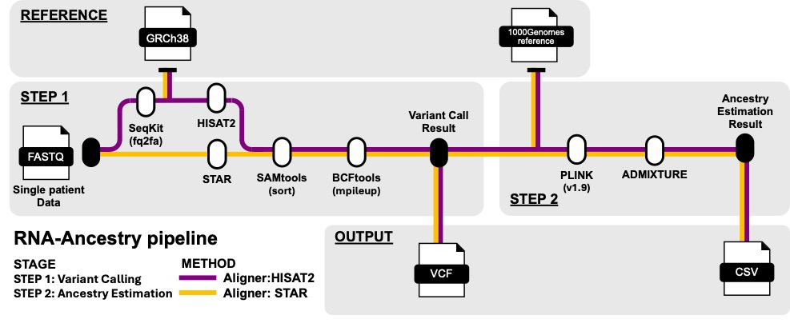

# An analytic pipeline to obtain reliable genetic ancestry estimates from tumor-derived RNA sequencing data 
A robust pipeline for inferring genetic ancestry from tumor RNA-seq data when germline DNA is unavailable.

## Citation
> Courtney E. Johnson, Ximing Ran, Julia Wrobel, Natalie R. Davidson, Casey S. Greene, Michael P. Epstein, Jeffrey R. Marks, Lauren C. Peres, Jennifer A. Doherty, Joellen M. Schildkraut. (2025). An analytic pipeline to obtain reliable genetic ancestry estimates from tumor-derived RNA sequencing data. *Cancer Epidemiol Biomarkers Prev*. https://doi.org/10.1158/1055-9965.EPI-25-0371
> 
## Background
This project addresses a critical gap in cancer genetics research where germline DNA samples are unavailable. Originally validated using epithelial ovarian cancer (EOC) studies, this pipeline enables reliable estimation of genetic ancestry using RNA-seq data from archival tumor tissue.

## Validation Study Results
- **Study Population**: 
  - 184 women with both germline and FFPE tumor samples
  - 58 women with only FFPE tumor tissue
- **Performance**:
  - Correlation with germline-derived ancestry: 0.76-0.94
  - Validated across African, European, and Asian genetic ancestry

## Pipeline Overview


## Tools Required
- SeqKit
- HISAT2
- SAMtools
- BCFtools
- PLINK
- ADMIXTURE

## Pipeline Installation
```bash
# Download the pipeline
git clone https://github.com/ranxm2/RNA_ancestry.git

# Initialize tools
chmod +x ./source/Initial/Setup-HISAT2.sh
bash ./source/Initial/Setup-HISAT2.sh
```

## Pipeline Input
```bash
fastq_1="demo_R1_001.fastq.gz"  # Forward reads
fastq_2="demo_R2_001.fastq.gz"  # Reverse reads
```

## Analysis Steps

### Step 1: Variant Calling
Choose one of the following aligners:

**HISAT2 (Recommended)**:
```bash
./source/map_HISAT2.sh ${fastq_1} ${fastq_2}
```

**Alternative - STAR**:
```bash
./source/map_STAR.sh ${fastq_1} ${fastq_2}
```

### Step 2: Ancestry Estimation
```bash
./source/estimate.sh
```

### Example Output
```bash
Ancestry       Proportion   N_SNPs    Estimation_Corr (95% CI)
African        75.5%        240001    0.78 (0.68-0.88)
European       13.2%        240001    0.62 (0.23-0.97)
Asian          11.3%        240001    0.32 (0.18-0.39)
```

